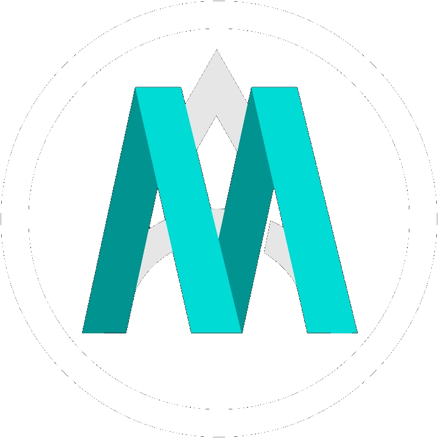

<div align="center">



# mkcodev.com

<a href="https://mkcodev.com">
  
</a>

<br/>

[](https://astro.build)
[](https://www.typescriptlang.org)
[](https://tailwindcss.com)
[](https://mkcodev.com)

[](https://gsap.com)
[](https://lenis.darkroom.engineering)
[](https://react.dev)
[](LICENSE)

<br/>

[**mkcodev.com**](https://mkcodev.com) · [Servicios](https://mkcodev.com/servicios) · [Blog](https://mkcodev.com/blog) · [Contacto](mailto:info@mkcodev.com)

</div>

---

## ¿Qué es esto?

Sitio web comercial de **Mikel Salvador García** — freelance de diseño y desarrollo web basado en Bilbao (Basauri). Construido desde cero con Astro 7, animaciones GSAP/Lenis, SEO local completo y un asistente IA integrado (Codi).

No es un template. Cada línea está razonada.

---

## Stack

<table>
<tr>
<td valign="top" width="33%">

### Core
- **[Astro 7](https://astro.build)** — framework, SSR, View Transitions, i18n
- **[TypeScript 5](https://www.typescriptlang.org)** — strict, sin `any`
- **[Tailwind CSS v4](https://tailwindcss.com)** — tokens en `@theme`, sin config JS
- **[React 19](https://react.dev)** — solo para islands interactivas

</td>
<td valign="top" width="33%">

### Animación & Scroll
- **[GSAP 3.15](https://gsap.com)** + ScrollTrigger — timelines, parallax, bento
- **[Lenis 1.3](https://lenis.darkroom.engineering)** — smooth scroll integrado con GSAP ticker
- **CSS View Transitions** — navegación con morphing nativo del browser

</td>
<td valign="top" width="33%">

### Infraestructura
- **[Vercel](https://vercel.com)** — SSR adapter, deploy automático desde `main`
- **[Upstash Redis](https://upstash.com)** — rate limiting serverless para Codi
- **[Google Gemini](https://ai.google.dev)** — modelo de Codi (AI chat)
- **[Astro OG Canvas](https://github.com/delucis/astro-og-canvas)** — OG images en build time

</td>
</tr>
</table>

---

## Features

<details>
<summary><strong>🎨 Diseño & Animaciones</strong></summary>

- Dark mode exclusivo — tokens CSS en `src/styles/tokens.css`
- Fuentes: Space Grotesk (display) + JetBrains Mono (terminal/labels)
- Hero con terminal interactiva (React island, comandos reales)
- Bento grid animado con GSAP ScrollTrigger
- Timeline de trayectoria con pin+scrub (solo ≥768px)
- Proyectos: cinema horizontal scroll en desktop, cards verticales en mobile
- About: crossfade foto ↔ ASCII art en hover
- Cursor custom (dot + ring) — solo desktop con puntero fino
- Animaciones de reveal por líneas (blur + translate)
- Glyph tunnels en los laterales del viewport (canvas)

</details>

<details>
<summary><strong>⚡ Navegación & UX</strong></summary>

- **⌘K / Ctrl+K** — paleta de comandos (React island, `client:idle`)
- **Vim navigation** — `g p`, `g s`, `g b`, `g t`, `g a`, `g c`, `j`/`k` scroll, `?` ayuda
- **Navbar** — mega menu con columna de servicios, toggle de idioma, progress ring
- View Transitions con `transition:persist` para Codi y paleta de comandos
- Lifecycle custom (`src/scripts/lifecycle.ts`) — re-init limpio en cada navegación sin memory leaks

</details>

<details>
<summary><strong>🤖 Codi — AI Chat</strong></summary>

- Asistente IA integrado en el sitio, personalidad "Codi"
- Modelo: **Gemini 2.0 Flash** vía API serverless
- Rate limiting serverless con Upstash Redis
- Guardarrailes: no habla de competidores, no inventa precios, deriva a contacto para presupuestos
- Orb animado (canvas) persistido entre navegaciones (`transition:persist`)
- Historial de conversación en sesión

</details>

<details>
<summary><strong>📝 Contenido & Blog</strong></summary>

- **i18n**: ES (default, sin prefijo) + EN (`/en/...`)
- **Páginas ES-only**: `/servicios`, `/diseno-web-bilbao`, `/diseno-web-zamora`, `/blog`, legales
- **Blog** con Astro Content Collections, RSS (`/rss.xml`), `reading time`, posts relacionados
- **6 páginas de servicio** con answer-first, precios desde X€, FAQs visibles, CTA
- **2 páginas de ubicación** (Bilbao/Gran Bilbao + Zamora) con NAP, schema LocalBusiness
- `llms.txt` con servicios, precios y zonas para crawlers IA

</details>

<details>
<summary><strong>🔍 SEO & GEO</strong></summary>

- Schema `@graph` — `Person` + `ProfessionalService/LocalBusiness` + `WebSite` + `WebPage` + `BreadcrumbList` + `Service` + `FAQPage` + `BlogPosting`
- `robots.txt` dinámico — permite OAI-SearchBot, ClaudeBot, PerplexityBot, GPTBot, Google-Extended
- Sitemap automático con filtro de páginas `noindex`
- hreflang solo en páginas con par EN (páginas esOnly solo llevan canonical)
- OG images generadas en build time para 23+ páginas
- Canonicals → `mkcodev.com`
- GA4 con **Consent Mode v2** (patrón basic AEPD) — `gtag.js` no se carga hasta consentimiento

</details>

---

## Arquitectura

```
mkcodev.com/
├── src/
│   ├── pages/                    # Rutas Astro (SSR)
│   │   ├── index.astro           # Home (ES)
│   │   ├── servicios/            # Hub + 6 páginas de servicio
│   │   ├── diseno-web-bilbao.astro
│   │   ├── diseno-web-zamora.astro
│   │   ├── blog/                 # Index + [slug]
│   │   ├── og/                   # OG images (build time)
│   │   ├── en/                   # Espejo EN
│   │   └── api/                  # Endpoints serverless (Codi)
│   ├── components/
│   │   ├── islands/              # React islands (Terminal, ⌘K, Codi)
│   │   └── *.astro               # Componentes vanilla
│   ├── scripts/                  # Módulos TS vanilla
│   │   ├── lifecycle.ts          # PATRÓN CENTRAL — re-init en View Transitions
│   │   ├── modules.ts            # Registro de todos los inits
│   │   ├── scroll.ts             # Lenis + ScrollTrigger integrados
│   │   └── *.ts                  # Un módulo por feature
│   ├── data/                     # Contenido y configuración
│   │   ├── site.ts               # SITE_URL, datos de contacto, NAP
│   │   ├── schema.ts             # Builders de JSON-LD (@graph)
│   │   ├── services.ts           # Los 6 servicios con precios y FAQs
│   │   └── projects.ts           # Proyectos reales
│   ├── content/blog/             # Posts Markdown
│   ├── styles/                   # tokens.css + global.css
│   └── i18n/                     # Traducciones + mapeo de rutas
└── public/
    └── fonts/                    # jbm-symbols.woff2 (subset custom)
```

---

## Dev local

```bash
# Instalar dependencias
pnpm install

# Dev server (http://localhost:4321)
pnpm dev

# Type check
pnpm astro check

# Build de producción
pnpm build

# Preview del build
pnpm preview
```

> **Requisito**: Node ≥ 22.12.0 · pnpm (nunca npm/yarn)

### Variables de entorno

Crea `.env.local` en la raíz:

```env
PUBLIC_GA_ID=G-XXXXXXXXXX          # GA4 — opcional en local
GEMINI_API_KEY=AIza...             # Codi AI — requerido para el chat
UPSTASH_REDIS_REST_URL=https://... # Rate limiting de Codi
UPSTASH_REDIS_REST_TOKEN=...       # Rate limiting de Codi
```

Sin `GEMINI_API_KEY`, Codi devuelve error silencioso. El resto del sitio funciona sin variables.

---

## Deploy

El proyecto despliega automáticamente en **Vercel** desde `main`.

```
push a main → Vercel build → mkcodev.com
```

Las 4 variables de entorno deben estar configuradas en Vercel → Settings → Environment Variables (solo Production).

---

## Patrones clave

### Lifecycle de View Transitions

`src/scripts/lifecycle.ts` es el patrón central. Cada módulo se registra con `onPageLoad(init)` donde `init` devuelve su función de cleanup:

```ts
// modules.ts
onPageLoad(initScroll);   // Lenis + ScrollTrigger
onPageLoad(initNavbar);   // Progress ring, spin logo
onPageLoad(initCursor);   // Custom cursor dot+ring
// ...
```

`astro:before-swap` → cleanups · `astro:page-load` → re-init. Sin esto, GSAP/Lenis se duplican tras cada navegación.

### Añadir una página nueva

1. Crear `src/pages/mi-pagina.astro` con `<Base lang="es" ... ogImage="/og/mi-pagina.png">`
2. Añadir entrada en `src/pages/og/[...slug].ts`
3. Si no tiene par EN: añadir a `esOnlyPrefixes` en `src/i18n/routes.ts`
4. Post-deploy: solicitar indexación en Search Console

---

<div align="center">

**[mkcodev.com](https://mkcodev.com)** · Bilbao · Zamora · Remote

<sub>Diseñado y desarrollado por Mikel Salvador García · © 2025</sub>

</div>
